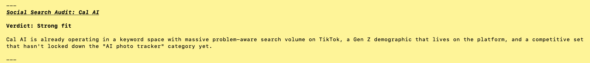
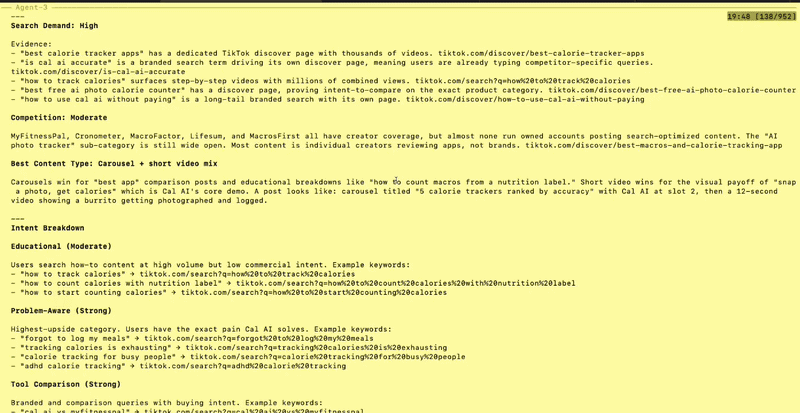
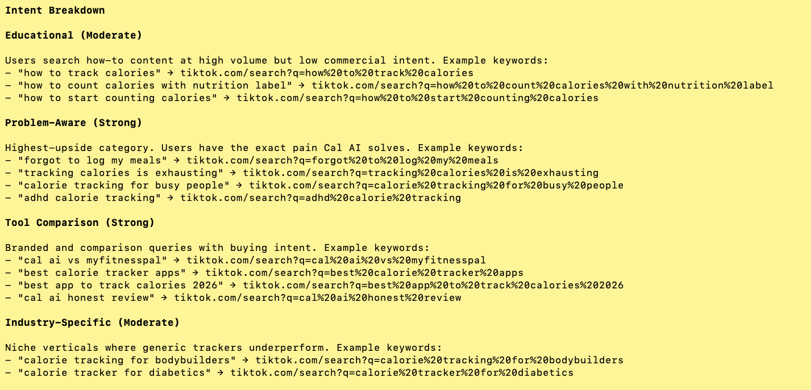
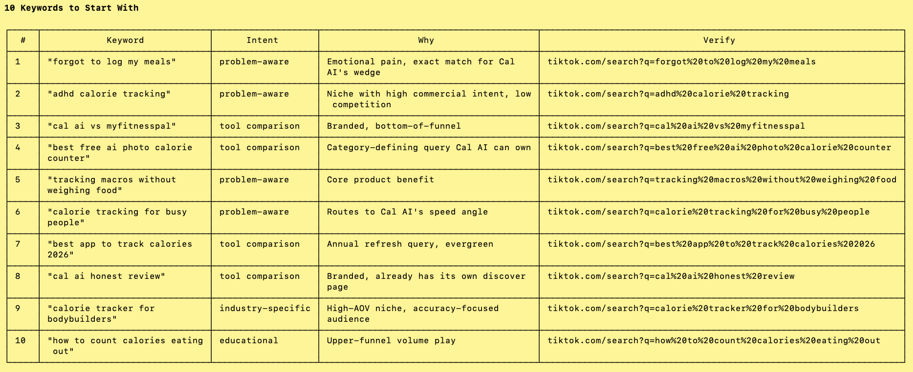

# ScaleBrick Marketing Skills

**The marketing system behind 353K views and 5,300 page visits in 47 days for a YC startup. $0 ad spend.**

Open-source Claude Code skills for startup founders and growth marketers. Built on the same methodology that powers ScaleBrick's AI VP of Marketing, Morgan.



Visit ScaleBrick: https://scalebrick.com

## Real client results

```
╭─── PROOF ─────────────────────────────────────────────────────╮
│                                                               │
│  Prana Health (YC-backed)                                     │
│    353K views and 5,300 page visits in 47 days. $0 ad spend.  │
│                                                               │
│  AIFlyer                                                      │
│    0 to 15,000 signups in 3 months. Ranks alongside Canva     │
│    in TikTok's LLM responses for flyer-related queries.       │
│    All organic.                                               │
│                                                               │
╰───────────────────────────────────────────────────────────────╯
```

Zero ad spend across both. No marketing team.

## Skills

| Skill | Command | What it does |
|-------|---------|-------------|
| **Social Search Audit** | `/scalebrick:audit` | Analyzes whether TikTok/Instagram is a viable growth channel for your business. Evaluates niche competition, search demand, and content type fit. |
| **Growth Strategy** | `/scalebrick:strategy` | Generates a full marketing strategy: core themes, content pillars, brand voice, 20+ keywords with intent categories, and a posting plan. |
| **Keyword Research** | `/scalebrick:keywords` | Finds high-intent keywords people are searching on TikTok/Instagram for your niche. Categorizes by type (educational, problem-aware, tool comparison) and rates conversion potential. |
| **Competitor Audit** | `/scalebrick:competitors` | Audits your top 5-7 competitors across SEO, content, and social media. Identifies gaps you can exploit, positioning angles no one is claiming, and 5 specific moves you can make this week. |

## See it in action

Running `/scalebrick:audit` on Cal AI, the AI calorie-tracking app that hit $8M ARR in months.



Intent breakdown across four categories, with real TikTok search URLs to verify every claim:



Ten keywords to start with, ranked by intent and conversion potential:



## Install

**One command in Claude Code:**

```
/plugin marketplace add ScaleBrick/scalebrick-marketing-skills
/plugin install scalebrick@scalebrick
```

That's it. All 4 skills are now available in your Claude Code session.

**Invoke any skill:**
```
/scalebrick:audit
/scalebrick:keywords
/scalebrick:strategy
/scalebrick:competitors
```

**Other AI agents (Cursor, Codex, Gemini CLI):**
Copy the `plugins/scalebrick/skills/` folder contents into your agent's skill directory. Each skill is a standalone SKILL.md file.

## How it works

Each skill is a structured methodology stored as a Markdown file. When you run a skill, Claude follows the methodology to analyze your specific business and produce actionable output.

No API keys needed. No account required. Just run the skill and get results.

The skills use Claude's reasoning to apply ScaleBrick's marketing frameworks to your business. They work best when you provide:
- Your business name and description
- Your target audience
- Your website URL (for audit and funnel skills)

## The methodology

These skills are built on one core insight: **40% of Gen Z uses TikTok and Instagram as search engines.** People type real questions into social search, and if your content shows up, that traffic is high-intent.

The framework:
1. **Find demand** - What are people searching for in your niche?
2. **Categorize intent** - Is this educational, problem-aware, or tool comparison? Each converts differently.
3. **Match content type** - Problem-aware content converts 54% better in some niches. Educational wins in others. You have to test.
4. **Focus ruthlessly** - 80% of content produces nothing. Find the 20% that works and kill the rest.
5. **Close the loop** - Track which keywords drive actual signups, not just views. Optimize based on conversions, not vanity metrics.

## Want the full system?

These skills give you the strategy. Morgan executes it.

Morgan is ScaleBrick's AI VP of Marketing. She runs the full growth loop: keyword research, content creation, publishing across channels, attribution tracking, and weekly optimization based on what's actually converting.

Try ScaleBrick free for 7 days:
https://scalebrick.com/signup?utm_source=github&utm_medium=skills_readme

## License

MIT
